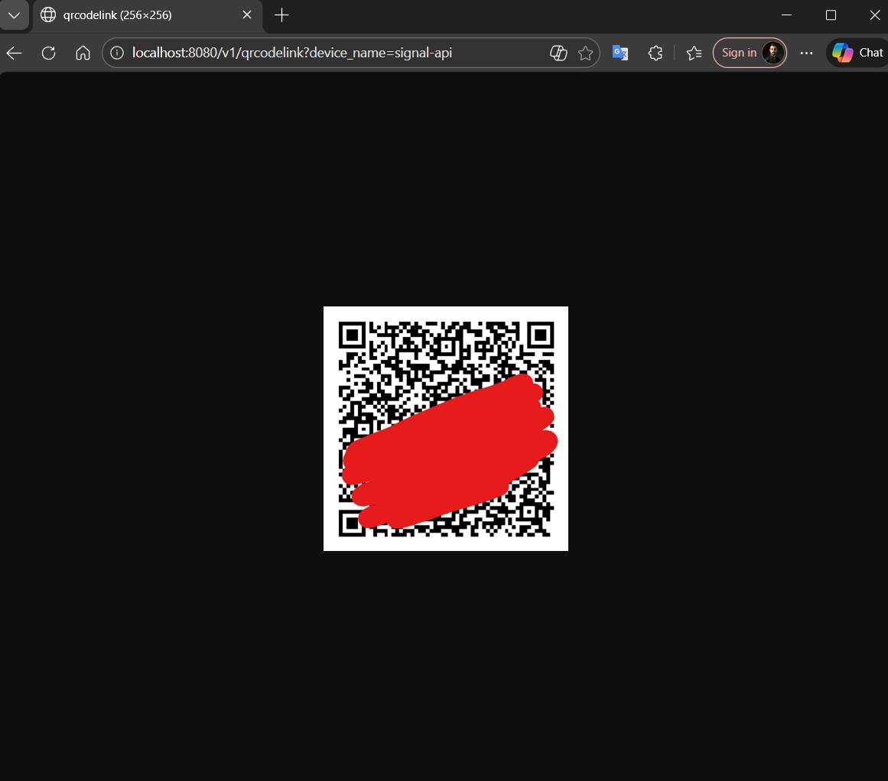
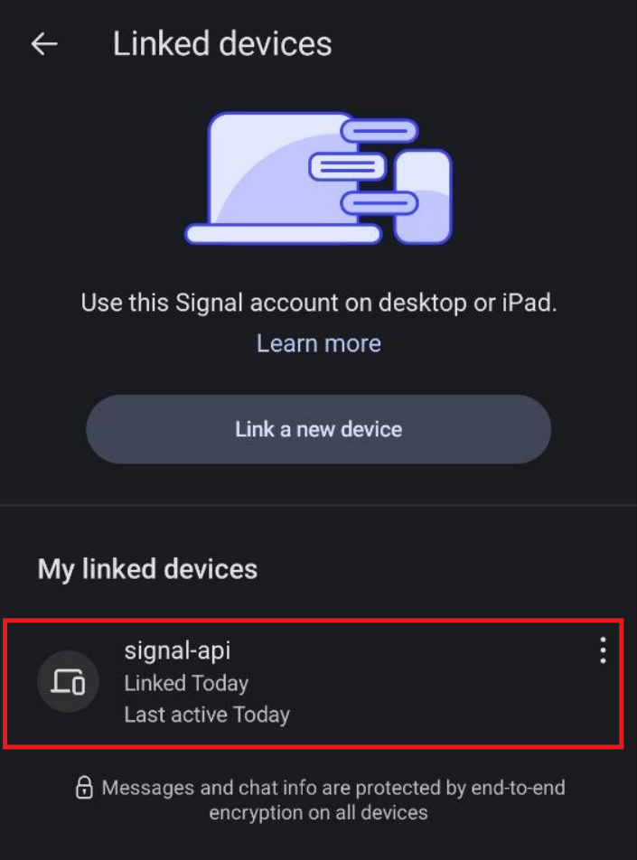
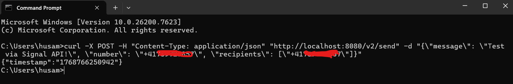
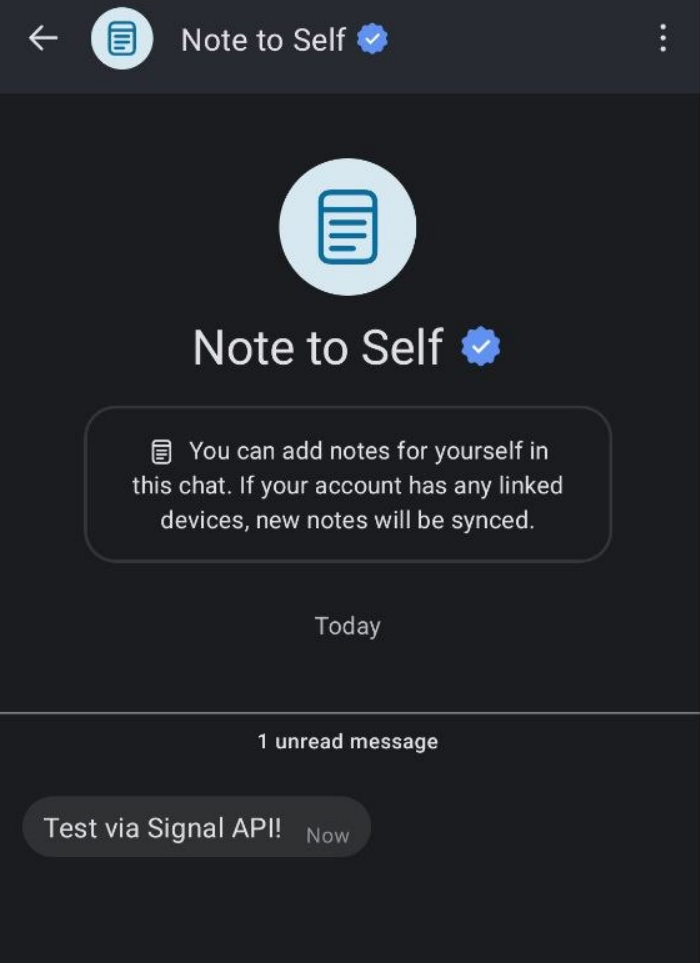

# Serilog.Sinks.Signal

A Serilog sink for sending log events via Signal messenger. Built on top of [Serilog.Sinks.Http](https://www.nuget.org/packages/serilog.sinks.http).

**Package**: [Serilog.Sinks.Signal](https://www.nuget.org/packages/serilog.sinks.signal)

**Supported Platforms:**
- .NET 4.6.1
- .NET Standard 2.0
- .NET Standard 2.1

---

## Table of Contents
- [Prerequisites](#prerequisites)
- [Signal CLI REST API Setup](#signal-cli-rest-api-setup)
- [Installation](#installation)
- [Configuration](#configuration)
- [Log Output Format](#log-output-format)

---

## Prerequisites

To send Signal messages, you need to set up a Signal API endpoint. We recommend using the [Dockerized Signal Messenger REST API](https://github.com/bbernhard/signal-cli-rest-api).

---

## Signal CLI REST API Setup

### 1. Download the Repository

Clone the Signal CLI REST API repository:

```bash
git clone https://github.com/bbernhard/signal-cli-rest-api.git
```

### 2. Start the Container

Navigate to the project directory and start the Docker container:

```bash
docker compose up -d
```

The API will be available at `http://localhost:8080`

### 3. Link Your Signal Account

**Step 1:** Navigate to the QR code link page in your browser:
```
http://localhost:8080/v1/qrcodelink?device_name=signal-api
```

**Step 2:** A QR code will appear on the screen



**Step 3:** Open the Signal app on your phone (using the number you want as sender)

**Step 4:** In Signal, tap:
- **Options** (top right) → **Settings** → **Linked devices** → **Link new device**

**Step 5:** Scan the QR code displayed in your browser

**Step 6:** Your Signal account is now linked and ready to use



### 4. Test the API

Verify the setup by sending a test message:

**Windows (Command Prompt):**
```bash
curl -X POST -H "Content-Type: application/json" "http://localhost:8080/v2/send" -d "{\"message\": \"Test via Signal API!\", \"number\": \"+41000000000\", \"recipients\": [\"+41111111111\"]}"
```

**Linux/Mac:**
```bash
curl -X POST -H "Content-Type: application/json" 'http://localhost:8080/v2/send' \
  -d '{"message": "Test via Signal API!", "number": "+41000000000", "recipients": ["+41111111111"]}'
```

**Expected response:**
```json
{"timestamp":"1768766250942"}
```

**Note:** Replace `+41000000000` with your sender number and `+41111111111` with your recipient number. If sender and recipient are the same, you'll receive a "note to self" message.



The result:


---

## Installation

Install the package via NuGet Package Manager:

```bash
PM> Install-Package Serilog.Sinks.Signal
```

Or via .NET CLI:

```bash
dotnet add package Serilog.Sinks.Signal
```

---

## Configuration

### Code-Based Configuration

```csharp
Log.Logger = new LoggerConfiguration()
    .MinimumLevel.Debug()
    .WriteTo.Signal(
        options: new Options
        {
            SignalSettings = new SignalSettings
            {
                RrequestUri = "http://localhost:8080/v2/send",
                SenderNumber = "+41000000000",
                Recipients = new[] { "+41111111111", "+41222222222" }
            },
            TimeStampInUtc = false,
            TimeFormat = "dd.MM.yyyy hh:mm:ss"
        },
        null,
        restrictedToMinimumLevel: LogEventLevel.Information)
    .CreateLogger();

Log.Information("Hello Serilog Signal");
```

### JSON Configuration (appsettings.json)

Using [Serilog.Settings.Configuration](https://github.com/serilog/serilog-settings-configuration):

```json
{
  "Serilog": {
    "MinimumLevel": "Information",
    "WriteTo": [
      {
        "Name": "Signal",
        "Args": {
          "options": {
            "SignalSettings": {
              "RrequestUri": "http://localhost:8080/v2/send",
              "SenderNumber": "+41000000000",
              "Recipients": [ "+41111111111", "+41222222222" ]
            },
            "TimeStampInUtc": true,
            "TimeFormat": "dd.MM.yyyy hh:mm:ss"
          },
          "queueLimitBytes": null
        }
      }
    ]
  }
}
```

### Configuration Options

| Option | Description |
|--------|-------------|
| `RrequestUri` | The Signal API endpoint URL |
| `SenderNumber` | Your Signal phone number (sender) |
| `Recipients` | Array of recipient phone numbers |
| `TimeStampInUtc` | Whether to use UTC time (true/false) |
| `TimeFormat` | Custom timestamp format |
| `logEventsInBatchLimit` | Number of log events to batch in a single request |

---

## Log Output Format

The sink batches multiple log events into single requests for efficiency. Log messages appear in Signal with the following format:

```
Timestamp: 15.01.2023 01:22:36

Level: 🔴Fatal

MessageTemplate:
"Object reference not set to an instance of an object."

RenderedMessage:
"Object reference not set to an instance of an object."

Exception:
"System.NullReferenceException: Object reference not set to an instance of an object.
   at Program.<Main>$(String[] args) in C:\TestProjects\source\code\Test.Store.Api\Program.cs:line 27"

Properties:
MachineName: "Husam"
ProcessId: 5512
ThreadId: 1
ExceptionDetail: [("Type": "System.NullReferenceException"), ("HResult": -2147467261), ("Message": "Object reference not set to an instance of an object."), ("Source": "Test.Store.Api"), ("StackTrace": " at Program.<Main>$(String[] args) in C:\TestProjects\source\code\Test.Store.Api\Program.cs:line 27"), ("TargetSite": "Void <Main>$(System.String[])")]
```

---

## Credits

This project is built on top of [Serilog.Sinks.Http](https://github.com/FantasticFiasco/serilog-sinks-http) by FantasticFiasco.